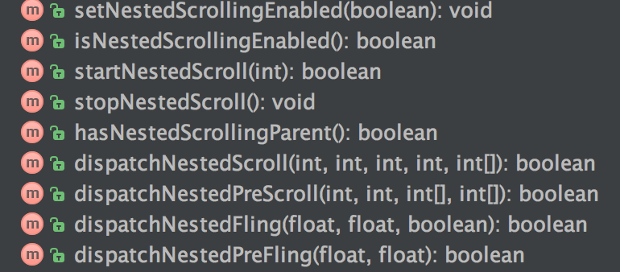

# NestScrollNote
## Lollipop到最新
### View

### ViewGroup(implements ViewParent)


## Lollipop之前  
support-compat -> android.support.v4.view
### NestedScrollingChild  


### NestedScrollingParent


support-core-ui -> android.support.v4.view
### NestedScrollingChildHelper

### NestedScrollingParentHelper

### ViewParentCompat


```java
static final ViewParentCompatImpl IMPL;
 static {
     final int version = Build.VERSION.SDK_INT;
     if (version >= 21) {
         IMPL = new ViewParentCompatLollipopImpl();
     } else if (version >= 19) {
         IMPL = new ViewParentCompatKitKatImpl();
     } else if (version >= 14) {
         IMPL = new ViewParentCompatICSImpl();
     } else {
         IMPL = new ViewParentCompatStubImpl();
     }
 }
```

```java
static class ViewParentCompatStubImpl implements ViewParentCompatImpl {
        ...
        @Override
        public boolean onStartNestedScroll(ViewParent parent, View child, View target,
                int nestedScrollAxes) {
            if (parent instanceof NestedScrollingParent) {
                return ((NestedScrollingParent) parent).onStartNestedScroll(child, target,
                        nestedScrollAxes);
            }
            return false;
        }
        ...
}
```  

```java
static class ViewParentCompatKitKatImpl extends ViewParentCompatICSImpl {

        @Override
        public void notifySubtreeAccessibilityStateChanged(ViewParent parent, View child,
                View source, int changeType) {
            ViewParentCompatKitKat.notifySubtreeAccessibilityStateChanged(parent, child,
                    source, changeType);
        }
    }
```

```java
static class ViewParentCompatLollipopImpl extends ViewParentCompatKitKatImpl {
        @Override
        public boolean onStartNestedScroll(ViewParent parent, View child, View target,
                int nestedScrollAxes) {
            return ViewParentCompatLollipop.onStartNestedScroll(parent, child, target,
                    nestedScrollAxes);
        }    
        ...   
}
```

```java
class ViewParentCompatLollipop {
    private static final String TAG = "ViewParentCompat";

    public static boolean onStartNestedScroll(ViewParent parent, View child, View target,
            int nestedScrollAxes) {
        try {
            return parent.onStartNestedScroll(child, target, nestedScrollAxes);
        } catch (AbstractMethodError e) {
            Log.e(TAG, "ViewParent " + parent + " does not implement interface " +
                    "method onStartNestedScroll", e);
            return false;
        }
    }
    ...
}
```
