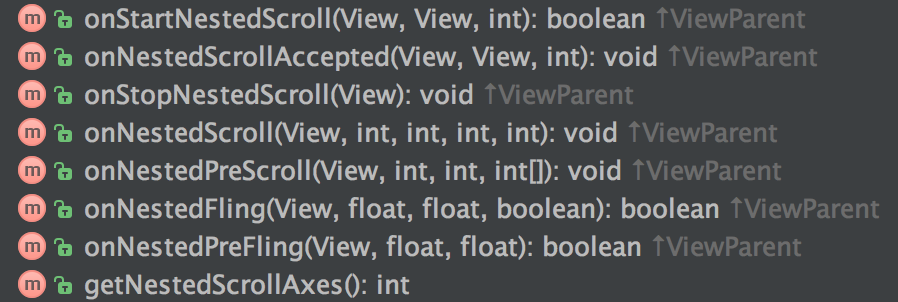
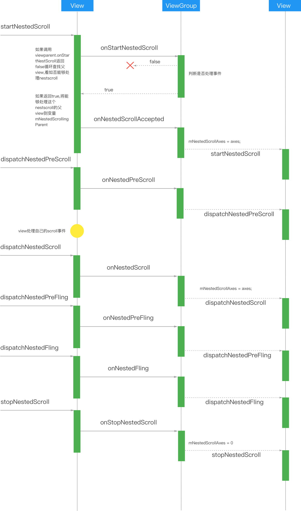
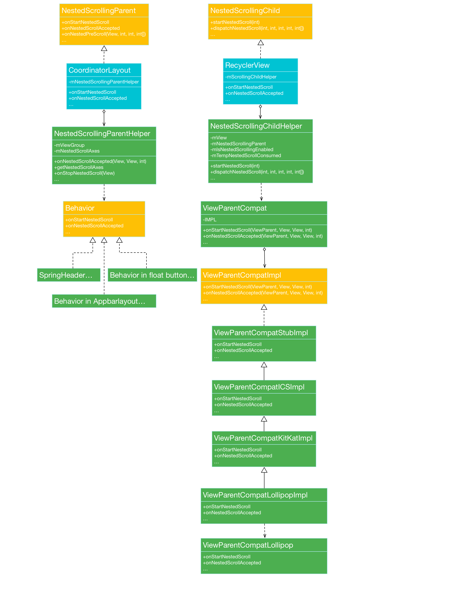
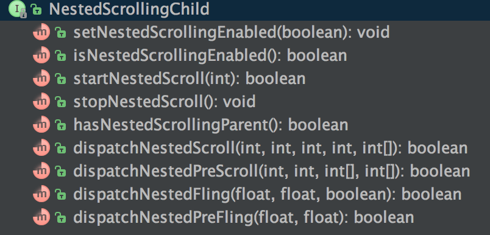
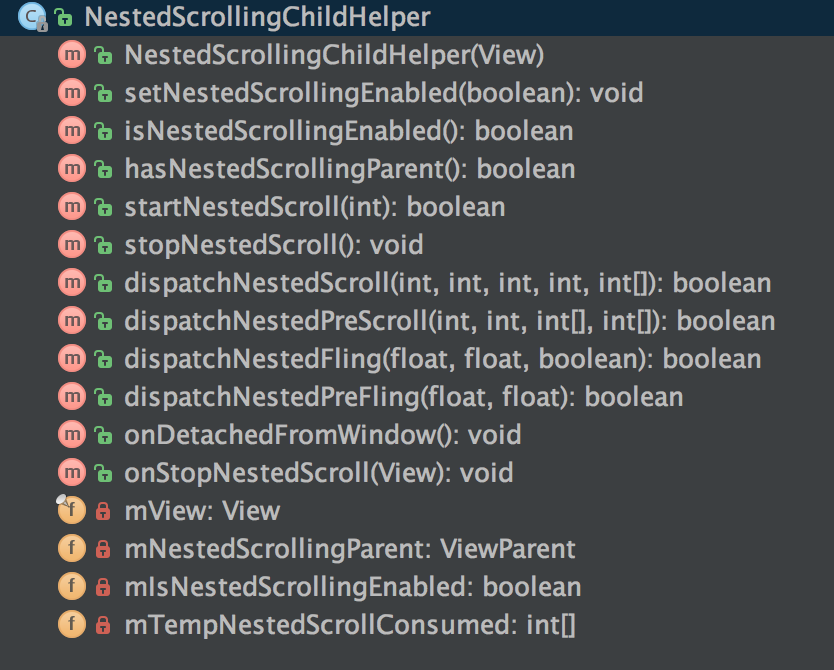
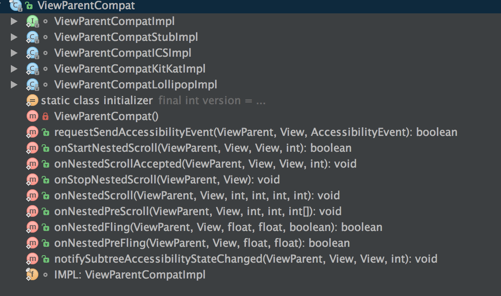
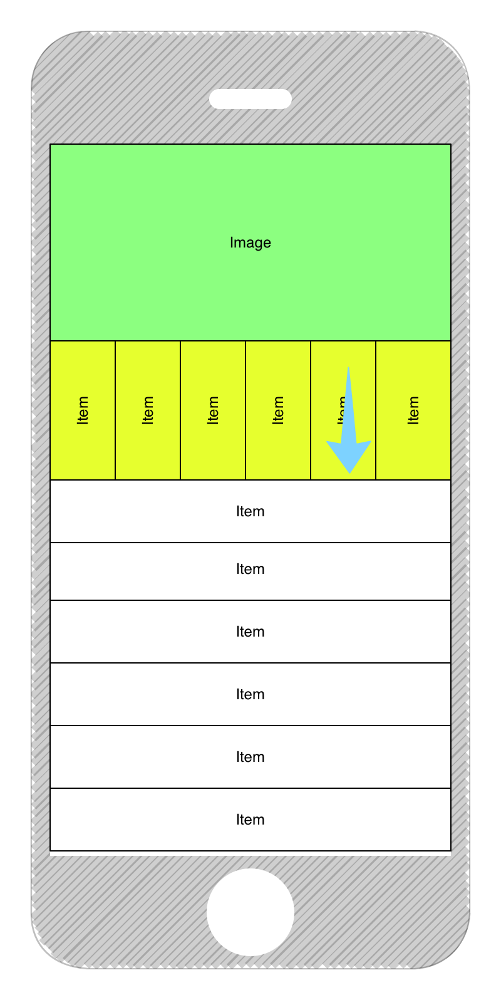
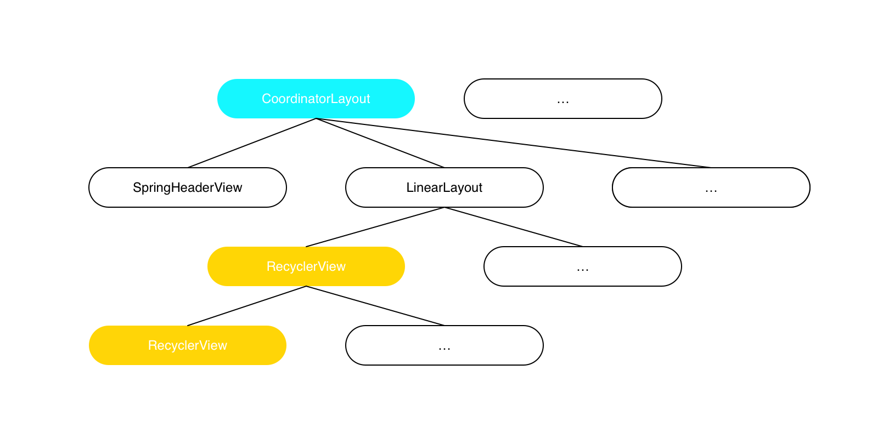
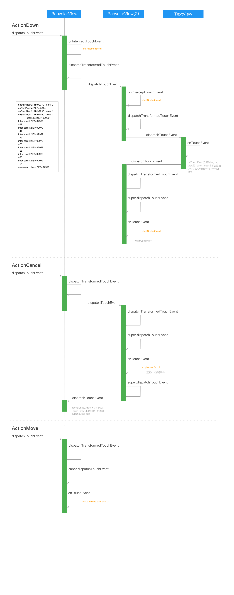

# NestScrollNote
## Lollipop到最新
### View

### ViewGroup(implements ViewParent)



## Lollipop之前  

support-compat -> android.support.v4.view
### NestedScrollingChild  


### NestedScrollingParent


support-core-ui -> android.support.v4.view
### NestedScrollingChildHelper

```java
    public boolean startNestedScroll(int axes) {
        if (hasNestedScrollingParent()) {
            // Already in progress
            return true;
        }
        if (isNestedScrollingEnabled()) {
            ViewParent p = mView.getParent();
            View child = mView;
            while (p != null) {
                if (ViewParentCompat.onStartNestedScroll(p, child, mView, axes)) {
                    mNestedScrollingParent = p;
                    ViewParentCompat.onNestedScrollAccepted(p, child, mView, axes);
                    return true;
                }
                if (p instanceof View) {
                    child = (View) p;
                }
                p = p.getParent();
            }
        }
        return false;
    }
```
### NestedScrollingParentHelper

### ViewParentCompat


```java
static final ViewParentCompatImpl IMPL;
 static {
     final int version = Build.VERSION.SDK_INT;
     if (version >= 21) {
         IMPL = new ViewParentCompatLollipopImpl();
     } else if (version >= 19) {
         IMPL = new ViewParentCompatKitKatImpl();
     } else if (version >= 14) {
         IMPL = new ViewParentCompatICSImpl();
     } else {
         IMPL = new ViewParentCompatStubImpl();
     }
 }
```

```java
static class ViewParentCompatStubImpl implements ViewParentCompatImpl {
        ...
        @Override
        public boolean onStartNestedScroll(ViewParent parent, View child, View target,
                int nestedScrollAxes) {
            if (parent instanceof NestedScrollingParent) {
                return ((NestedScrollingParent) parent).onStartNestedScroll(child, target,
                        nestedScrollAxes);
            }
            return false;
        }
        ...
}
```  

```java
static class ViewParentCompatKitKatImpl extends ViewParentCompatICSImpl {

        @Override
        public void notifySubtreeAccessibilityStateChanged(ViewParent parent, View child,
                View source, int changeType) {
            ViewParentCompatKitKat.notifySubtreeAccessibilityStateChanged(parent, child,
                    source, changeType);
        }
    }
```

```java
static class ViewParentCompatLollipopImpl extends ViewParentCompatKitKatImpl {
        @Override
        public boolean onStartNestedScroll(ViewParent parent, View child, View target,
                int nestedScrollAxes) {
            return ViewParentCompatLollipop.onStartNestedScroll(parent, child, target,
                    nestedScrollAxes);
        }    
        ...   
}
```

```java
class ViewParentCompatLollipop {
    private static final String TAG = "ViewParentCompat";

    public static boolean onStartNestedScroll(ViewParent parent, View child, View target,
            int nestedScrollAxes) {
        try {
            return parent.onStartNestedScroll(child, target, nestedScrollAxes);
        } catch (AbstractMethodError e) {
            Log.e(TAG, "ViewParent " + parent + " does not implement interface " +
                    "method onStartNestedScroll", e);
            return false;
        }
    }
    ...
}
```

## 示例
###问题  
CoordinatorLayout内部包含SpringHeader,垂直RecyclerView，RecyclerView内部item包含一个纵向的RecyclerView,当向下拉时SpringHeader没有下拉效果

###View层次图

###在5.0以下的系统4.4上时序图，从外层RecyclerView接收到触摸事件开始

事件传递到内部RecyclerView的TextView时，onTouchEvent返回false不处理，所以内部RecyclerView直接调用自己的super.dispatchTouch执行onTouchEvent
```java
if (mFirstTouchTarget == null) {
                // No touch targets so treat this as an ordinary view.
                handled = dispatchTransformedTouchEvent(ev, canceled, null,
                        TouchTarget.ALL_POINTER_IDS);
            } else {
                // Dispatch to touch targets, excluding the new touch target if we already
                ...
            }
```

当内部RecyclerView接收到Cancel事件时，不再往下传递，直接处理，完成Cancel处理之后handle=true,父RecyclerView从TouchTarget中移除内部RecyclerView,所以后面MOVE事件直接传到外部RecyclerView
```java
if (alreadyDispatchedToNewTouchTarget && target == newTouchTarget) {
                        handled = true;
                    } else {
                        final boolean cancelChild = resetCancelNextUpFlag(target.child)
                                || intercepted;
                        if (dispatchTransformedTouchEvent(ev, cancelChild,
                                target.child, target.pointerIdBits)) {
                            handled = true;
                        }
                        if (cancelChild) {
                            if (predecessor == null) {
                                mFirstTouchTarget = next;
                            } else {
                                predecessor.next = next;
                            }
                            target.recycle();
                            target = next;
                            continue;
                        }
                    }
                    predecessor = target;
                    target = next;
                    }
```
内部RecyclerView cancelTouch时会执行stopNestedScroll，然后会重置Springheader所在的LayoutParams的NestedScrollAccepted状态，导致后面的移动事件传到CoordinatorLayout接受不到
```java
@Override
    public void onStopNestedScroll(View target) {
        mNestedScrollingParentHelper.onStopNestedScroll(target);

        final int childCount = getChildCount();
        for (int i = 0; i < childCount; i++) {
            final View view = getChildAt(i);
            final LayoutParams lp = (LayoutParams) view.getLayoutParams();
            if (!lp.isNestedScrollAccepted()) {
                continue;
            }

            final Behavior viewBehavior = lp.getBehavior();
            if (viewBehavior != null) {
                viewBehavior.onStopNestedScroll(this, view, target);
            }
            lp.resetNestedScroll();
            lp.resetChangedAfterNestedScroll();
        }

        mNestedScrollingDirectChild = null;
        mNestedScrollingTarget = null;
    }
```
```java
if (!lp.isNestedScrollAccepted()) {
                continue;
            }
```
解决方法是在OnTouchEvent执行cancel之后，在重新startNest,不过这只是5.0之下的解决方法，5.0有一点区别
###在5.0及之上时序图，从外层RecyclerView接收到触摸事件开始

红色方法表示5.0会多执行的方法，在5.0里面View里的dispatchTouch里会在ACTION_DOWN和ACTION_UP,DOWN且!result...执行执行stopNest,所以在onTouchEvent执行ACTION_CANCEL之后执行startNest还不够，得在dispatchTouch执行stopNest
```java
 public boolean dispatchTouchEvent(MotionEvent event) {
        ...
        final int actionMasked = event.getActionMasked();
        if (actionMasked == MotionEvent.ACTION_DOWN) {
            // Defensive cleanup for new gesture
            stopNestedScroll();
        }
        ...
        if (actionMasked == MotionEvent.ACTION_UP ||
                actionMasked == MotionEvent.ACTION_CANCEL ||
                (actionMasked == MotionEvent.ACTION_DOWN && !result)) {
            stopNestedScroll();
        }

        return result;
    }
```

